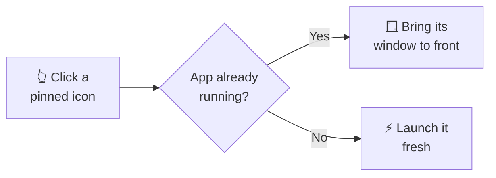
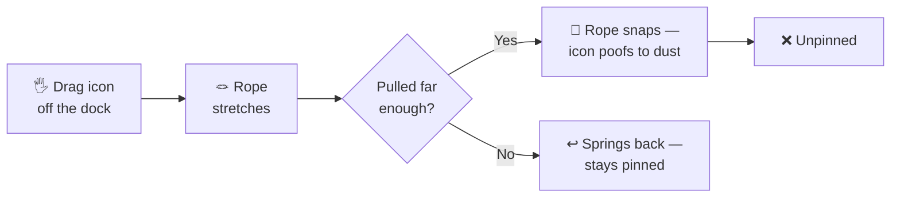
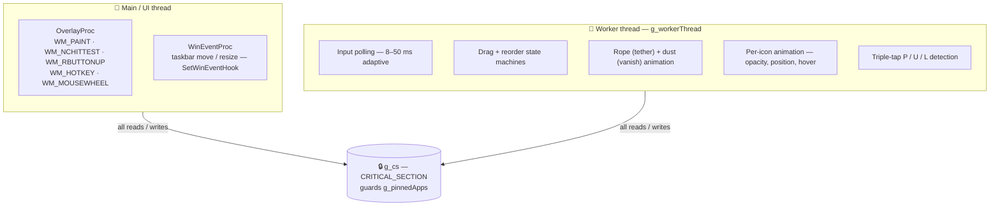

<div align="center">

# 📌 Left Taskbar Quick Pin Dock

**Your own mini app dock, tucked neatly to the left of the Start button.**

[](https://windhawk.net/mods/taskbar-quick-pin)
[](#changelog)
[](#)
[](#)

</div>

Pin any app with a **drag**. **Click** it to launch or focus. **Drag it off** to let it go. That's the whole idea — a fast, good-looking launcher that lives right inside your Windows 11 taskbar and remembers your apps across restarts.

> 🪶 **Lightweight by design.** One single-file C++ mod injected into `explorer.exe` — no extra DLLs, no background service, no installer. It never moves or resizes your taskbar; it simply floats a transparent dock on top of it.

### Why you'll like it

- 🎯 **Your own list** — completely separate from the taskbar's built-in pinned apps.
- 📦 **Pins anything** — any `.exe`, not just Store apps or shortcuts.
- 🖐️ **Drag to pin** — just drop an app window onto the dock, no right-click menus.
- ⚡ **Click to launch or focus** — brings a running app forward, or starts a fresh one.
- ↔️ **Reorder by dragging** — rearrange icons live, with smooth animation.
- 🪢 **Playful drag-off** — a stretchy "rope" follows your icon; snap it to unpin, with a little dust-poof.
- 🔒 **Lock it** — freeze the dock so a stray gesture never drops a pin.
- 🖱️ **Scroll through pins** — hover and spin the mouse wheel to glide across your apps.
- 🪟 **Frosted-glass look** — an optional rounded, blurred panel.
- 💾 **Remembers everything** — survives Explorer restarts, sign-outs, and reboots.

---

## Table of Contents

### 👤 Part I — User Guide

*Everything you need to actually use the dock. If you just want to pin apps, this is all you need — no tech knowledge required.*

1. [What it does](#1-what-it-does)
2. [Get started in 30 seconds](#2-get-started-in-30-seconds)
3. [Every gesture, at a glance](#3-every-gesture-at-a-glance)
4. [Pinning and unpinning](#4-pinning-and-unpinning)
5. [Locking the dock](#5-locking-the-dock)
6. [Scrolling through lots of pins](#6-scrolling-through-lots-of-pins)
7. [Settings — in plain English](#7-settings--in-plain-english)
8. [Tips & FAQ](#8-tips--faq)
9. [Troubleshooting](#9-troubleshooting)
10. [Known limitations](#10-known-limitations)

### 🛠️ Part II — Developer Reference

*How it works under the hood. You don't need any of this to use the dock — it's here for the curious and for contributors. It assumes you've read Part I, so it won't re-explain what a gesture does — only how it's built.*

11. [Architecture at a glance](#11-architecture-at-a-glance)
12. [Thread model & locking](#12-thread-model--locking)
13. [Startup & geometry stabilisation](#13-startup--geometry-stabilisation)
14. [The overlay window](#14-the-overlay-window)
15. [App-identity resolver](#15-app-identity-resolver)
16. [Drag & reorder state machines](#16-drag--reorder-state-machines)
17. [The drag rope (tether)](#17-the-drag-rope-tether)
18. [The dust vanish effect](#18-the-dust-vanish-effect)
19. [Dynamic dock sizing & scrolling](#19-dynamic-dock-sizing--scrolling)
20. [Rendering, glass & rounded corners](#20-rendering-glass--rounded-corners)
21. [Persistence](#21-persistence)
22. [Multi-monitor docks](#22-multi-monitor-docks)
23. [Safety guards & exclusions](#23-safety-guards--exclusions)
24. [Hooks, build flags & dependencies](#24-hooks-build-flags--dependencies)
25. [Contributing](#25-contributing)
26. [Changelog](#changelog)

---
---

# 👤 Part I — User Guide

## 1. What it does

This mod adds a small, persistent icon dock right next to the Start button on your Windows 11 taskbar. Think of it as a personal shelf for the apps you open most.

It's **your own list** — it has nothing to do with the taskbar's built-in pinned apps, and it can hold **any program** (not just Store apps). You add apps by dragging, launch them with a click, and it quietly remembers them forever — even after a restart.

The dock floats on top of the taskbar as a see-through panel. It never resizes or moves your taskbar, and it stays neatly inside the taskbar's height.

### How it works — at a glance

*No need to read the whole guide — here's the whole idea in three little pictures.*

**Pinning an app** 📌


**Clicking a pinned icon** 👆



**Unpinning (drag it off)** 💨



---

## 2. Get started in 30 seconds

1. Install the mod through Windhawk (search for **`taskbar-quick-pin`**, or load the `.cpp` file manually).
2. The dock appears just left of Start. It starts **empty** — that's normal.
3. Open any app you want to keep handy (Notepad, Chrome, VS Code…).
4. **Drag that app's window (or its taskbar button) toward the dock.** A little preview follows your cursor.
5. **Drop it on the dock.** The icon fades and slides into place. 🎉
6. From now on, **click the icon** any time to open or jump to that app.

> ⏳ **First run — please be patient.** On the very first launch the dock needs a moment to find the taskbar and settle, so it may not appear instantly. That's normal — it's working in the background. If it still hasn't shown up after a couple of minutes, restart Explorer (or, most reliably, your PC). You can also raise the **Startup delay** setting.

---

## 3. Every gesture, at a glance

| You do this… | …and this happens |
| --- | --- |
| Drag any app window or taskbar button onto the dock | **Pins** the app |
| **Left-click** a pinned icon | **Focuses** it if running, **launches** it if not |
| Drag a pinned icon **left / right** inside the dock | **Reorders** it, live |
| Drag a pinned icon **off** the dock until the rope snaps | **Unpins** it (with a dust poof) |
| **Double-right-click** a pinned icon | **Unpins** it *(off by default — turn on in settings)* |
| **Triple-click** any icon quickly | **Unpins everything** |
| Tap **P** three times quickly | **Pins** the app you're currently using |
| Tap **U** three times quickly | **Unpins** the app you're currently using |
| Tap **L** three times quickly | **Locks / unlocks** the dock |
| Press the **hotkey** (default **Ctrl + Alt + P**) | Pins or unpins the app you're currently using |
| **Scroll** the mouse wheel over the dock | Glides the highlight across your pinned icons |
| Hover an icon | It gently **magnifies**, macOS-style |

> The three-tap **P / U / L** shortcuts must land within about **0.6 seconds**. The triple-click "unpin all" must land within about **1 second**.

---

## 4. Pinning and unpinning

**To pin an app**, drag its window (or its taskbar button) onto the dock and let go. You can also:

- Tap **P** three times quickly to pin whatever app you're using right now, or
- Press the hotkey (**Ctrl + Alt + P** by default) to do the same.

**To unpin one app**, you have a few choices — pick whichever feels natural:

- **Drag it off the dock.** A stretchy "rope" links the icon to your cursor. Pull far enough and the rope **snaps** — the icon bursts into dust and is gone. By default the icon stays put if you let go before the rope breaks (you can change this — see *Unpin trigger* in settings).
- **Double-right-click it** (only if you've enabled that setting).
- **Tap U three times quickly** to unpin the app you're currently using.
- **Press the hotkey** while using an app that's already pinned — it toggles off.

**To clear the whole dock**, quickly **triple-click** any icon.

> 🧱 **The dock only holds so many.** By default it fits **5** apps, and you can raise this up to **20** in settings. If you try to add one when it's full, the dock briefly **flashes** to let you know.

---

## 5. Locking the dock

Worried about accidentally knocking an app off? **Tap the L key three times quickly to lock the dock.** Tap **L** three times again to unlock it.

While locked:

- ✅ You can still **pin** new apps and **reorder** them.
- 🚫 The quick *gesture* unpins are refused — **triple-tap U**, the **triple-click "unpin all"**, **double-right-click**, and the **hotkey's unpin** all stop working, so a stray gesture can't drop a pin.
- 🪢 A **deliberate drag-off that breaks the rope still unpins** — that's a hard-to-do-by-accident action, so it's always allowed.

When you attempt something that's blocked, the dock gives a little **glow flash** to remind you it's locked.

---

## 6. Scrolling through lots of pins

The dock **sizes itself to fit** what you've actually pinned. Unpin a few and it shrinks; pin more and it grows — but it stops growing at **10 visible icons** so it never hogs your taskbar.

Pin more than 10 and the extras don't make the dock wider. Instead, **hover the dock and spin your mouse wheel** to glide the highlight across all your apps (wheel down = next, wheel up = previous). The highlighted icon pops out like the macOS dock. This scroll-wheel navigation can be turned off in settings if you prefer.

---

## 7. Settings — in plain English

All settings live in the Windhawk settings panel under this mod. **Most apply instantly** ("live"); a couple need a mod reload, which is noted below.

| Setting | What it does | Default |
| --- | --- | --- |
| **Max pinned apps** | How many apps you can pin, from 1 to 20. | `5` |
| **Icon size** | How big each icon is (before your display scaling). 16–48. At 150% scaling, `33` looks like ~50 px. | `33` |
| **Dock gap from Start** | How far the whole dock sits from the Start button, 0–40 px. | `6` |
| **Separator opacity** | Visibility of the little divider line between the dock and the rest of the taskbar. 0 = hidden, 100 = solid. | `100` |
| **Glass overlay** | Draws a subtle frosted-glass tint behind the dock, and gives richer pin/unpin colour feedback. | `on` |
| **Drag to reorder** | Lets you drag icons left/right to rearrange them. Off = dragging an icon only unpins it. | `on` |
| **Double-right-click to unpin** | Unpin an icon by double-right-clicking it (with a dust effect). Off = normal right-click menu shows instead. | `off` |
| **Scroll-wheel navigation** | Hover + scroll to move the highlight across your pins. | `on` |
| **Drag tether (rope)** | Shows the stretchy thread while you drag an icon off to unpin. Turn off for a plain drag with no thread. | `on` |
| **Drag tether — thickness** | How thick the rope looks, 1 (hair-thin) to 10 (bold cord). | `2` |
| **Drag tether — break length** | How far you pull before the rope snaps and unpins, 150–650 px. Lower = snaps sooner. | `450` |
| **Unpin trigger** | *When* a drag-off actually unpins. `0` = only when the rope **breaks** (let go early and it springs back, staying pinned). `1` = rope breaks **or** you drop it anywhere off the dock. | `0` |
| **Corner roundness** | Dock corner shape, 0–100. 0 = square, 1–40 = slightly rounded, 41–100 = fully rounded pill. Always smooth. | `100` |
| **Explorer workspace pins** | Allow File Explorer to be dragged in as a special "workspace" pin. Off = Explorer is ignored. | `off` |
| **Multi-monitor dock** | Show a **mirrored, read-only** dock on each secondary monitor. Only the primary supports pinning. *(Reload to apply.)* | `off` |
| **Startup delay** | Extra wait before the dock loads, 0–3000 ms. Raise it if the dock appears in the wrong spot at login. | `0` |
| **Sync with taskbar auto-hide** | Hide the dock along with the taskbar when auto-hide slides it off screen. | `off` |
| **Logging level** | Diagnostic detail: None / Errors / Important / Debug / Trace. Only raise it while chasing a specific bug. | `1` (Errors) |
| **Pin hotkey — modifiers** | Which modifier keys to hold for the pin/unpin hotkey. Set to "Disabled" to switch the hotkey off. | `Ctrl + Alt` |
| **Pin hotkey — key** | Which key to press with the modifiers above. | `P` |

---

## 8. Tips & FAQ

**Does this replace my normal taskbar pins?**
No. This dock is a completely separate list. Your Windows pinned apps stay exactly where they are.

**Will the running dot tell me if an app is open?**
Yes — a small dot under an icon means that app has a window open, so a click will *focus* it. No dot means a click will *launch* it fresh.

**Can I pin a portable `.exe` or a game launcher?**
Yes. Almost any real program works — it doesn't have to be a Store app or a Start-menu shortcut.

**How do I change the hotkey?**
Set the **modifiers** and **key** separately in settings. Set modifiers to "Disabled" to turn the hotkey off entirely.

**Where are my pins stored?**
In your Windows registry, under your user account, so they survive restarts. (Path is listed in the developer section.)

---

## 9. Troubleshooting

**The dock didn't appear right away.**
On first launch it needs a moment to detect the taskbar. Wait a minute or two. If it's still missing, restart Explorer or your PC, and try raising the **Startup delay** setting.

**The dock showed up in the wrong position.**
This usually means the taskbar was still loading. Raise **Startup delay** (e.g. to 1000–2000 ms). It self-corrects on most systems once the taskbar settles.

**An app shows a generic/blank icon.**
A few apps use custom icon handlers that no Windows API can read reliably. This is a shell limitation, not a bug in the dock.

**A dragged app got pinned as the wrong program.**
Some UWP apps briefly report their host process if their window isn't ready. Try dragging again once the app has fully opened.

**My gesture didn't unpin anything.**
Check whether the dock is **locked** (you'll see a glow flash when you try). Tap **L** three times to unlock. Remember: while locked, only a rope-breaking drag-off unpins.

---

## 10. Known limitations

- **Secondary-monitor docks are mirrored and read-only** — *Beta*. Only the primary dock can pin/unpin.
- **A few apps show a generic Windows icon** — a shell limitation; no Win32 API resolves every icon reliably.
- **Some UWP apps may resolve to their host process** if their window isn't ready when you drag them.

---
---

# 🛠️ Part II — Developer Reference

*This half documents the implementation for contributors. It builds on Part I — features are referred to by name (rope, dust vanish, lock, scroll-nav…) rather than re-described.*

## 11. Architecture at a glance

The mod is a single `.cpp` file compiled by Windhawk's embedded Clang toolchain and injected as a DLL into `explorer.exe`. It **hooks no Win32 functions**. It listens to accessibility events for taskbar geometry and registers its own overlay windows in the Explorer process.



> *(GitHub renders the diagram above automatically.)*

`g_pinnedApps` is the only shared mutable state; every access goes through `g_cs`. Per-frame worker-only globals (`g_dragState`, `g_hoverIndex`, `g_anyAnimationActive`, `g_appScrollStart`…) are single-writer and read by the main thread only for display.

**Key tunables (compile-time):**

| Constant | Value | Meaning |
| --- | --- | --- |
| `MIN_APP_SLOTS` | 5 | Dock never shrinks below this |
| `MAX_VISIBLE_APP_SLOTS` | 10 | Dock never grows past this; extras scroll |
| `MAX_WORKSPACE_PINS` | 2 | Left-anchored Explorer workspace pins |
| `KEY_TAP_WINDOW_MS` | 600 | Window for the P / U / L triple-taps |
| `RAPID_CLICK_WINDOW_MS` | 1000 | Window for triple-click "unpin all" |
| `RUNNING_STATE_CHECK_MS` | 500 | Period between running-app scans |
| `HOVER_SCALE_FACTOR` | 1.15 | Hover magnify amount |
| `VANISH_MS` | 900 | Dust disintegration duration |
| `SCROLL_NAV_LOCK_MS` | 700 | How long a wheel-selected highlight is protected |

---

## 12. Thread model & locking

**Main thread** owns the overlay windows, processes all `WM_*` messages, and receives WinEvent geometry notifications. It never does slow I/O — registry writes are deferred outside any lock.

**Worker thread** (`g_workerThread`, created in `Wh_ModInit`, exited via `g_exitEvent`) runs an adaptive polling loop (8 ms while active, 16 ms cool-down, 50 ms when idle). It owns the drag/reorder machines, all animation, the rope and dust effects, and the triple-tap gestures.

**Cross-thread rules:**

- `g_pinnedApps` — always under `g_cs`.
- Overlay/ghost/tether/vanish windows are created on the main thread; the worker only calls `InvalidateRect`, `ShowWindow`, and `UpdateLayeredWindow` on windows it owns.
- `SavePinnedApps()` snapshots paths under `g_cs`, then releases before registry I/O.
- The double-right-click unpin runs on the main thread but hands the dust request to the worker via interlocked globals (`g_vanishReq*`), because all vanish GDI must run on the worker thread.
- `g_secondaryDocks` has its own dedicated lock (the worker iterates it in `RepaintSecondaryDocks`).

---

## 13. Startup & geometry stabilisation

The taskbar's exact size isn't known at injection. `RefreshTaskbarCache()` drives a three-state FSM on the worker thread:

```
STATE_BOOT  →  first valid width  →  STATE_STABILISING  →  two stable reads (±10 px)  →  STATE_STABLE
```

On each transition that commits a new `g_dockLocalW`, `ReseatIconPositions()` recomputes every icon's `targetX`/`currentX`. Without it, icons loaded from the registry (which start at position 0, before the width is known) would pile up at the left until the first pin/unpin. `startupDelay` adds an optional pre-init wait for slow logins.

---

## 14. The overlay window

`WS_POPUP` + `WS_EX_LAYERED | WS_EX_TRANSPARENT | WS_EX_NOACTIVATE | WS_EX_TOOLWINDOW`, `HWND_TOPMOST`. It is exactly the dock's width and the taskbar's height, right-edge aligned to Start (minus `dockGapFromStart`).

- **`WM_NCHITTEST`** returns `HTCLIENT` only over icon slots (via `HitTestIcon`), `HTTRANSPARENT` elsewhere — so the taskbar underneath keeps receiving all other input.
- **`WM_PAINT`** double-buffers through `g_alphaBlendDC`.
- **`WM_RBUTTONUP`** implements double-right-click unpin (respects the lock and the enable setting).
- **`WM_HOTKEY`** toggles the focused app's pin (respects the lock for the unpin direction).
- **`WM_MOUSEWHEEL`** drives scroll-nav highlight paging.

---

## 15. App-identity resolver

Identifying *which* app is under the cursor at mouse-down runs a layered pipeline:

- **Layer 0 — dock hit test:** cursor over an existing icon uses that slot's `exePath` (reorder / unpin path).
- **Layer 1 — UI Automation:** `IUIAutomation::ElementFromPoint` → `NativeWindowHandle` / AUMID (`kAumidPropId = 30113`) → process path. Resolves UWP and grouped taskbar buttons.
- **Layer 2 — `WindowFromPoint` fallback:** raw window → PID → path. Returns `NULL` if it hits the overlay itself.
- **Layer 3 — last resort:** if all fail, the drag is cancelled (the foreground window is deliberately *never* used, so dragging from empty taskbar space pins nothing).

**Hover pre-sampling:** while hovering, the resolver runs read-only every loop and caches `g_hoverCandidate` with a timestamp. At mouse-down, a fresh candidate is used directly, so the drag feels instant.

---

## 16. Drag & reorder state machines

The worker runs a drag FSM each iteration: `DRAG_IDLE → DRAG_PRESS → {SmartLaunch | DRAG_REORDER | DRAG_DRAGGING} → DRAG_DROPPED → DRAG_IDLE`, with `DRAG_CANCELLED` as the forced-reset path.

- A quick release (within `CLICK_MAX_MS`, under `CLICK_MAX_MOVE_PX`) is a **click** → `SmartLaunch(idx)` (focus if running, else `ShellExecuteExW`, rate-limited).
- Travel past `REORDER_THRESHOLD_PX` over an icon → `DRAG_REORDER`; `UpdateReorderPositions()` spreads the other icons around the gap, `CommitReorder()` does the `std::rotate` and saves.
- Travel past `DRAG_THRESHOLD_PX` off an icon → `DRAG_DRAGGING` (pin/unpin path, ghost preview + rope).
- `HardStateReset()` is the safety net (called from `WM_RBUTTONUP` and unpin-all) — clears drag paths, indices, ghost, and forces `DRAG_IDLE`.

---

## 17. The drag rope (tether)

A separate layered window (`g_tetherWnd` / `g_tetherDIB` / `g_tetherBits`) draws the "balloon thread" between the icon's dock slot and the cursor during an unpin drag. It is purely decorative.

- The moving tip is spring-smoothed (`THREAD_SPRING = 0.42`, frame-rate scaled) for a lively whip lag.
- `THREAD_MAX_STRETCH_PX` (= `dragRopeBreakLength`, 150–650) is the max length. Past it the rope **tears mid-thread** (`g_tetherBreaking`, frozen anchor/tip) and fires the unpin + dust vanish.
- Released before breaking with `unpinTrigger = 0` → the rope **retracts** (`g_tetherRetracting`) and the icon stays pinned. With `unpinTrigger = 1`, dropping anywhere off the dock also unpins.
- Appearance: `THREAD_THICKNESS` (1–10), colour mode/hue (`THREAD_COLOR_MODE`, `THREAD_HUE`, default earthy tan). The window is pre-warmed at init (`PrewarmLayered`) to avoid first-use lag.

---

## 18. The dust vanish effect

The "Thanos" disintegration (`VANISH_MS = 900`) is a self-contained particle system on its own layered window (`g_vanishWnd` / `g_vanishDIB`):

`BeginVanish()` → `AddIconVanish()` (samples the icon into `VanishParticle`s with drift velocities) → `CommitVanish()` (derives accent colour, bounding box, clamps to 4096²) → `UpdateVanishWindow()` advances one frame per tick and presents via `UpdateLayeredWindow`. One vanish can span many icons at once (used by unpin-all). It supports both the double-right-click unpin (requested from the main thread via `g_vanishReq*`) and the mid-drag rope break.

---

## 19. Dynamic dock sizing & scrolling

The app region resizes to fit: never below `MIN_APP_SLOTS` (5), never above `MAX_VISIBLE_APP_SLOTS` (10). Beyond 10 pins the region becomes a fixed **viewport**; `g_appScrollStart` selects which contiguous window of ordinals is shown, and the mouse wheel pages it. `g_scrollNavUntil` / `g_scrollNavPt` protect a wheel-selected highlight from stray `WM_MOUSEMOVE` for `SCROLL_NAV_LOCK_MS`. Workspace pins (`enableExplorerWorkspacePins`, max `MAX_WORKSPACE_PINS = 2`) are left-anchored and always visible. `g_dockWidthDirty` triggers a re-fit when counts change.

---

## 20. Rendering, glass & rounded corners

`WM_PAINT` draws all icons into a persistent off-screen buffer (`g_alphaBlendDC`/`g_alphaBlendBmp`) then blits once. Per icon: position + hover scale, `DrawIconEx` at `opacity*255`, running dot, lifted-source dimming, drop-zone highlight, and the limit flash.

- **Glass** (`enableGlassOverlay`): DWM system-backdrop when available, else a manual GDI alpha rectangle.
- **Rounded corners** (`cornerRoundness` 0–100): DWM corner attribute (`DWMWCP_DONOTROUND` / `ROUNDSMALL` / `ROUND`) plus a continuous clip radius `= (h * 0.5) * (roundness / 100)`, so it's smooth and live-updatable, never pixelated.
- **Separator** (`separatorOpacity`): 0 = none, 100 = solid `LineTo`, 1–99 = cached DIB alpha-blended column.

---

## 21. Persistence

```
HKEY_CURRENT_USER\Software\WindhawkMods\taskbar-quick-pin
  Value: PinnedApps (REG_MULTI_SZ)  — one full exe path per entry, in dock order
```

`SavePinnedApps()` snapshots paths under `g_cs`, then writes outside the lock (after every pin/unpin/unpin-all/reorder). `LoadPinnedApps()` runs at init: validates each path exists, extracts the icon, appends to `g_pinnedApps`; missing paths are silently dropped. Positions are corrected later by `ReseatIconPositions()`.

---

## 22. Multi-monitor docks

`multiMonitorDock` creates a **mirrored, read-only** secondary overlay per non-primary taskbar. Secondary docks share `g_pinnedApps` and are driven by the primary worker via `RepaintSecondaryDocks()` (guarded by their own lock). They update on `WM_DISPLAYCHANGE`. Drag-to-pin works on the **primary only**; this is Beta. (Note: the primary dock itself is composed of layered surfaces — the app overlay plus the rope/vanish overlays — which is why you may see more than one dock-owned window on the primary monitor.)

---

## 23. Safety guards & exclusions

- **`IsSystemWindow`** rejects Explorer, `SearchHost`, `ShellExperienceHost`, `StartMenuExperienceHost`, `LogonUI`, and classes `Progman` / `Shell_TrayWnd` / `WorkerW`.
- **`IsExcludedApp`** rejects `RuntimeBroker`, `WerFault`, `CredentialUIBroker`, `ApplicationFrameHost` (the hosted UWP app is used instead). `explorer.exe` is excluded unless `enableExplorerWorkspacePins` is on.
- **Icon quality guard** rejects blank/hidden icons and the shell's generic placeholder silhouette.
- **Duplicate guard** (`IsPinned`) and **capacity guard** (`MaxIconsFit()` vs `maxPinnedApps`, with the limit flash on overflow).

---

## 24. Hooks, build flags & dependencies

**No Win32 API hooks.** The mod only uses `SetWinEventHook` (accessibility events), `RegisterHotKey`, in-process `IUIAutomation`, and `SHAppBarMessage` (auto-hide). If it ever crashes, Explorer simply unloads the DLL and the dock disappears — no trampoline risk.

```
@compilerOptions -lpsapi -lshell32 -lole32 -loleaut32 -luuid -lshlwapi
                 -lgdi32 -lmsimg32 -luiautomationcore -ldwmapi -lwinmm
```

`-lwinmm` is used to raise the system timer resolution to 1 ms so `Sleep(8)` is honoured for smooth animation. Targets `x86_64-pc-windows-msvc`, C++17, Windows 11.

---

## 25. Contributing

Contributions welcome — bug reports, docs, and features.

- **Issues:** [ramensoftware/windhawk-mods](https://github.com/ramensoftware/windhawk-mods/issues).
- **Pull requests:** keep the single-file structure, respect the thread-safety rules in §12, and make sure GDI resources are created once and freed in `Wh_ModUninit` (in reverse order). Be extremely careful adding any new cross-thread shared state — route it through `g_cs` or interlocked globals like the vanish request path.
- The codebase has zero external dependencies and runs entirely inside `explorer.exe`. Avoid hooking Win32 functions.

---

## Changelog

### v2.0.0

- 🪢 **Drag rope (tether)** with configurable thickness, break length, and colour; plus an **unpin trigger** choice (only-on-break vs break-or-drop-outside).
- 💨 **Dust ("Thanos") disintegration** effect on unpin.
- 🔒 **Lock the dock** with triple-tap **L**, including an interactive lock-glow flash; gesture-unpins are refused while locked.
- ⌨️ **Triple-tap P / U** to pin / unpin the focused app.
- 🖱️ **Scroll-wheel navigation** across pins with macOS-style magnify.
- 📐 **Dynamic dock sizing** — shrinks to a 5-slot minimum, grows to a 10-slot cap, then scrolls.
- 🪟 **Live corner roundness** (0–100) via DWM, and richer glass feedback.
- 🗂️ **Explorer workspace pins** (opt-in), **dock gap from Start**, and a **logging level** setting.
- 🖥️ **Multi-monitor** mirrored read-only docks *(Beta)*.

### v1.0.0

- Initial release of Taskbar Quick Pin Dock.

---

<div align="center">

Created with ❤️ by **Ashix** · [GitHub](https://github.com/k-ashix) · [X](https://x.com/k_ashix)

Thanks to the **Taskbar Dock Animation** and **Taskbar Dock Animation Plus** mods for animation refinements.

</div>
